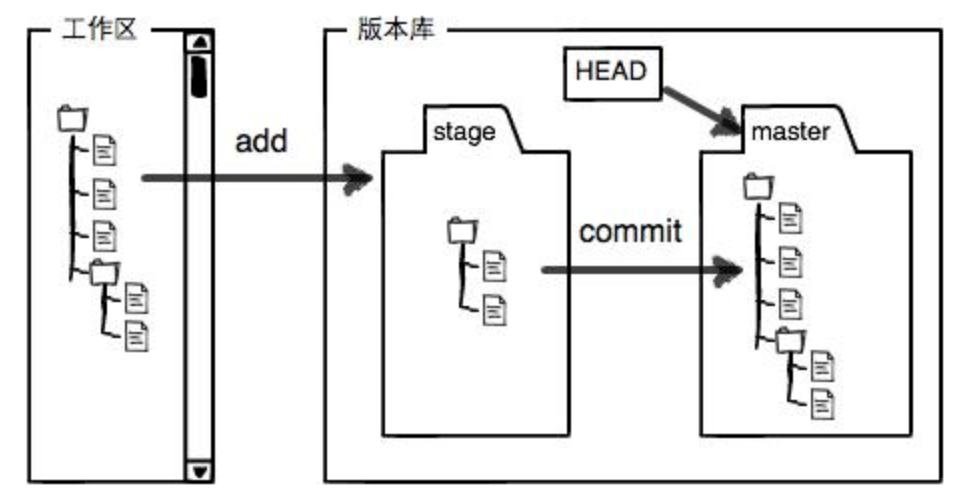
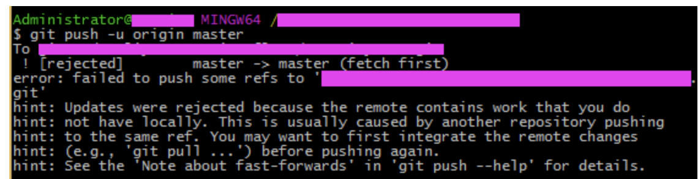

# ssh

### 其实ssh很容易理解，通过命令行可以生成2把钥匙：一把公钥，一把私钥。公钥需要安装在服务器端

# 以git为例，阐释如何实现ssh免密登陆
将本地代码上传到远程仓库的时候，打开命令行窗口，进入到本地代码的文件夹。
```
$ touch README.md
$ git init
$ git add README.md
1
2
3
```
### 但这一步是添加README.md文件，初始化git，这样在本地文件夹下会生成README.md和.git两个文件。具体这两个文件是做什么的，可以自行百度，不过一句话概括的话，是将本地仓库与远程仓库关联起来。
```
$ git add .
$ git commit -m "first commit"
1
2
``` 

<p>到commit这一步，只是完成了本地提交。这里为什么有一个add一个commit的过程，有必要解释一下。在git中有一个暂存区的概念，add就是将代码从工作区提交到暂存区；commit的过程就是将代码从暂存区提交到版本库。git add . 是提交全部文件到暂存区，git commit -m后面相当于给本次提交加一个注释。</p> 
<p>这里解释一下git为什么有暂存区的概念，这是和SVN所不同的。git是分为工作区和版本库的，工作区就是我们本地看到的工作目录，版本库就是你工作目录中的.git文件。</p>



<p>版本库中存放了很多东西，比如stage,就是我们上面提到的暂存区，还有自动创建的master分支，还有指向master的head指针…….我们不能手动修改版本库内的任何数据，否则可能会造成不可预期的错误。所以我们上面，将工作区的代码提交到版本库是分为两个步骤的，第一步是通过add命令将文件添加到暂存区stage中；第二步将暂存区中的数据提交到版本库中，用commit命令，其实就是将stage中的内容提交到当前分支。我们在创建git版本库时，会为我们自动创建一个master主分支，当然我们还可以手动创建其他分支，当前分支是什么，我们commit的时候就将stage的内容提交到该分支上。</p>
```
$ git remote add origin git@xx.xx.xx.xx:repos/xxx/xxx/xxx.git
$ git push -u origin 分支名
1
2
```

<p>最后将版本库中的代码提交到远程分支上去。到这里，将本地代码提交到远程仓库的步骤就全部完成了。我在提交的时候也遇到一些问题，拿出来我们一起分享下 </p>




<p>出现错误的原因是git服务器中的README.md文件不在本地代码目录中，可以通过如下命令进行代码合并</p>

```
git pull --rebase origin master
1
```

<p>执行上面的代码就可以使本地和git服务器同步了。其实如果有时间，可以好好研究一下这个.git和README.md文件。.git文件里面存放的内容上面简单介绍了一下，README.md文件要研究起来内容还是蛮多的，这里推荐一个博客感觉介绍的挺好的，感兴趣的源儿们可以看一下原来Github上的README.md文件这么有意思——Markdown语言详解 </p>
<p>好了 这篇博客就介绍到这里，顺便推荐一下廖雪峰关于git的文章，介绍的非常好，非常适合初学研究，整体看下可以形成一个宏观的知识体系。好的，先这样，后续再更新。</p>

## direct push
```
git init   // 初始化版本库

git add .   // 添加文件到版本库（只是添加到缓存区），.代表添加文件夹下所有文件 

git commit -m "first commit" // 把添加的文件提交到版本库，并填写提交备注

```
### 到目前为止，我们完成了代码库的初始化，但代码是在本地，还没有提交到远程服务器，所以关键的来了，要提交到就远程代码服务器，进行以下两步：
```
git remote add origin 你的远程库地址  // 把本地库与远程库关联

git push -u origin master    // 第一次推送时

git push origin master  // 第一次推送后，直接使用该命令即可推送修改

```

# 推荐文章
- [mac git 公司必备](http://www.jianshu.com/p/f848cf9c0b39)
- [ssh](https://www.cnblogs.com/Mrs-cc/p/4699611.html)

